# Reimbify - Android Mobile Application

Reimbify is an Android application that simplifies the reimbursement process through an intuitive mobile interface, machine learning for receipt validation, and a REST API-based backend service. It streamlines the submission, approval, and tracking of reimbursement requests for both users and administrators.

---

## Table of Contents
-  [Features](#features)
-  [Technologies Used](#technologies-used)
-  [Setup and Installation](#setup-and-installation)
-  [App Screenshots](#app-screenshots)
-  [Project Structure](#project-structure)
-  [Contributor](#contributor)

---

## Features

### **Authentication**
- **Login**
- **Forgot Password**: Request password recovery.
- **Reset Password**: Secure password reset.

### **Admin-Side**
- **Dashboard**: Monthly insights for company reimbursements.
- **Review Requests**: Approve or reject submitted reimbursement requests.
- **Task History**: View approval/rejection history.
- **User Management**: Register and delete application user.
- **Profile Settings**: Update admin profile details.
- **Switch Theme**: Toggle between light and dark modes.

### **User-Side**
- **Submit Reimbursement Request**: Users can upload receipts and enter request details.
- **Receipt Image Validation**: Verify receipt authenticity using machine learning.
- **Status Tracking**: Check the approval/rejection status of submitted requests.
- **Profile Settings**: Update user information.
- **Switch Theme**: Choose between light and dark themes.

---

## Technologies Used

### **Frontend**
- Android Studio
- Kotlin

### **Backend**
- REST APIs

---

## Setup and Installation

### Prerequisites
- Android Studio installed (latest version).
- REST API endpoint configurations.

### Steps
1. Clone the repository:
   ```bash
   https://github.com/reimbify-bangkit-2024/reimbify-android-app.git
   ```

2. Open the project in **Android Studio**.
3. Update the BASE_URL and BASE_URL_MODEL endpoints in the build.gradle.kts
4. Build and run the project
5. Ensure backend services are up and running.

### APK Installation
If you prefer not to build the project, you can download the APK file directly:
- Path: `build-apk/reimbify-v1.5.apk` or `reimbify-android-app/ReimbifyApp/app/build/outputs/apk/debug/reimbify-v1.5.apk` 
- Transfer the APK to your Android device and install it.

---

## App Screenshots

### Authentication

#### Login Page
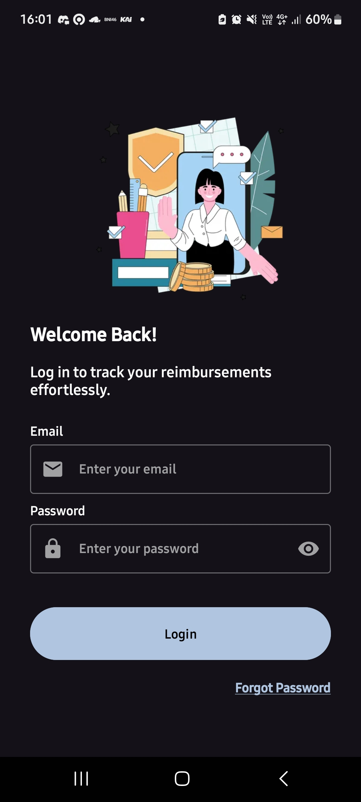

#### Forgot Password
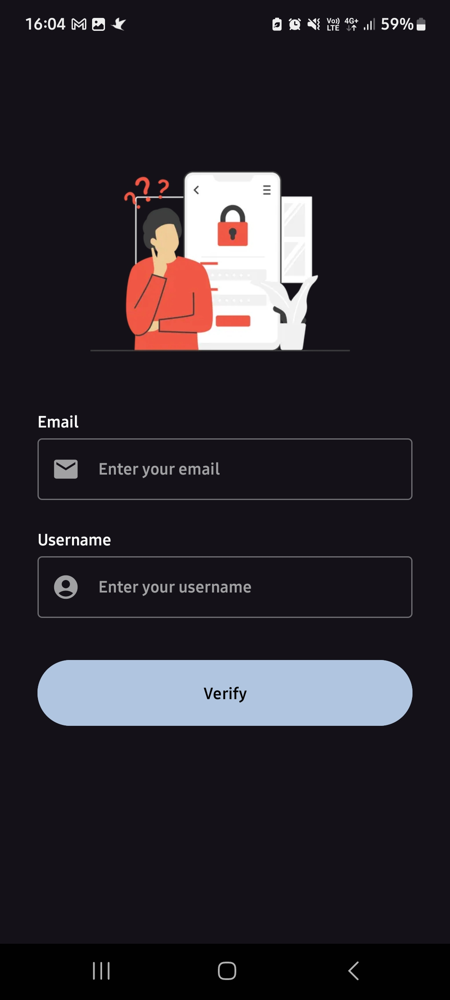

#### Verify OTP
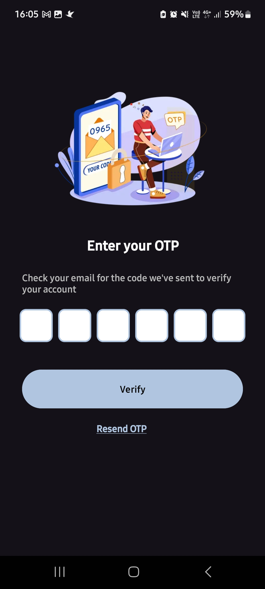

#### Reset Password
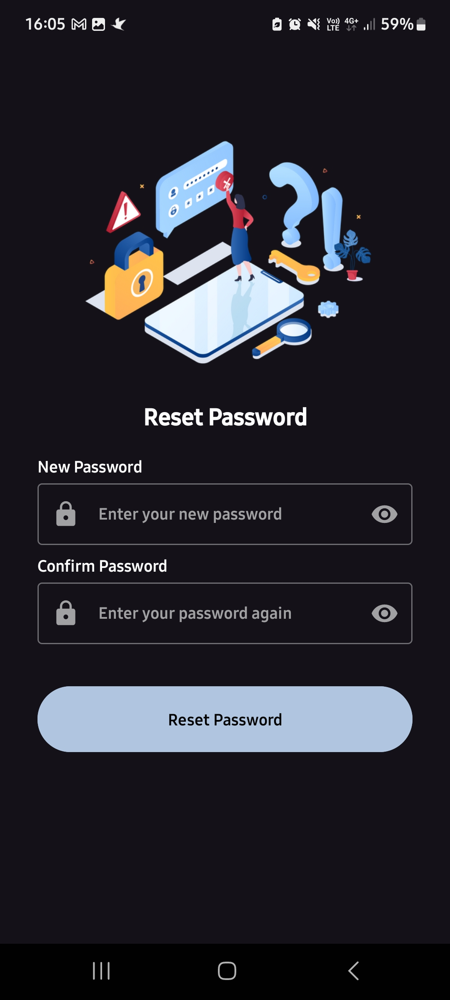

### Admin-side

#### Dashboard


#### Task List (Request Under-Review)
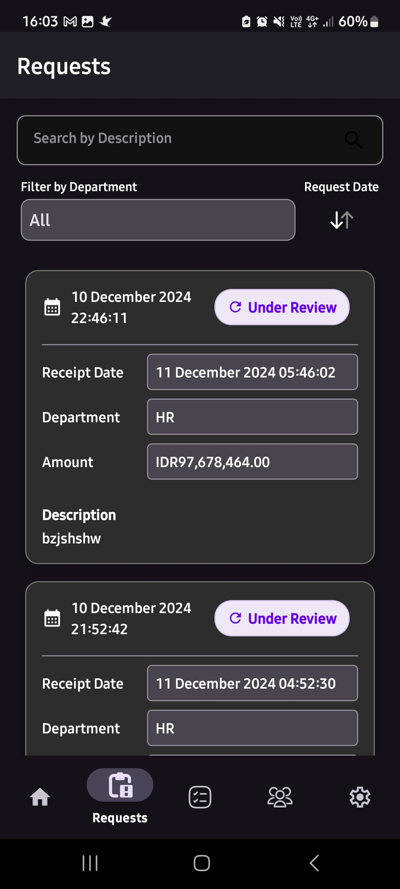

#### Reviewed Request History
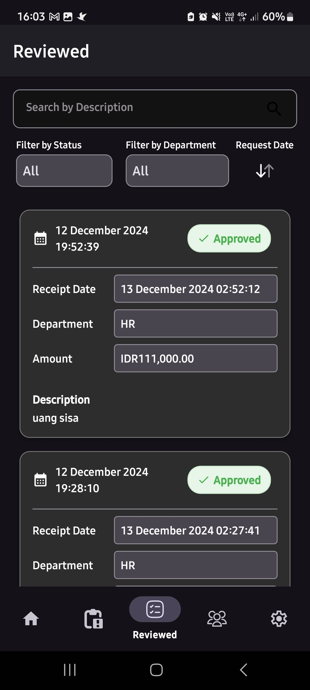

#### User Management
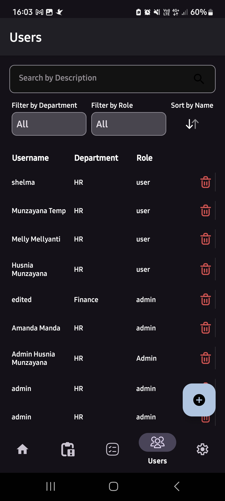

#### Profile and Setting
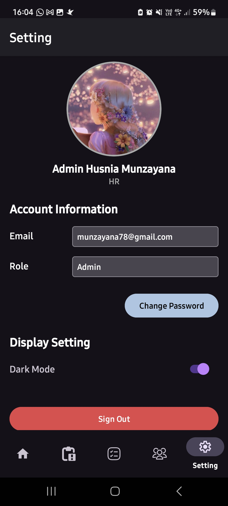

### User-side

#### Dashboard
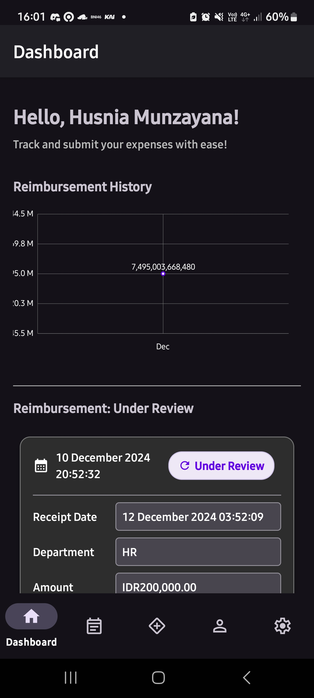

#### Request List
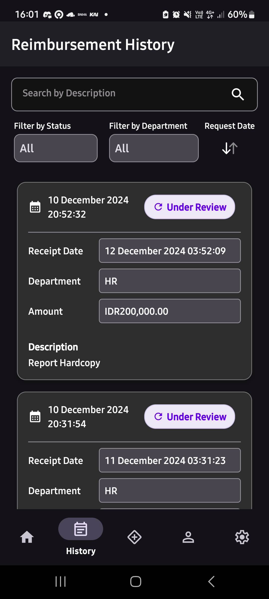

#### New Request
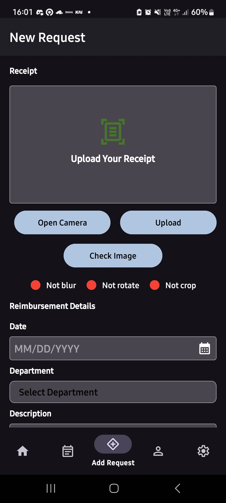

#### Request Detail
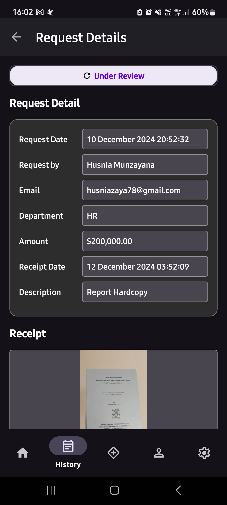

#### User Profile
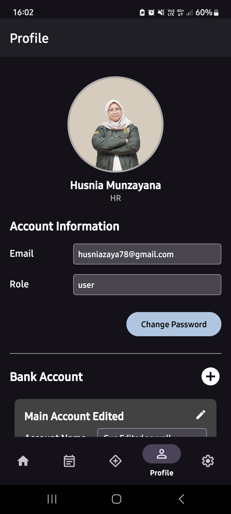


---

## Project Structure
```plaintext
ReimbifyApp/
├── .gradle/
│   ├── 8.9/
│   ├── buildOutputCleanup/
│   ├── kotlin/
│   └── vcs-1/
├── .idea/
│   ├── caches/
│   └── inspectionProfiles/
├── app/
│   ├── build/
│   │   ├── generated/
│   │   ├── intermediates/
│   │   ├── outputs/
│   │   ├── tmp/
│   │   ├── kotlin/
│   │   └── logs/
│   ├── sampledata/
│   ├── src/
│   │   ├── androidTest/
│   │   │   └── java/
│   │   │       └── com/example/reimbifyapp/
│   │   ├── main/
│   │   │   ├── java/
│   │   │   │   └── com/example/reimbifyapp/
│   │   │   │       ├── admin/
│   │   │   │       │   ├── factory/
│   │   │   │       │   └── ui/
│   │   │   │       │       ├── adapter/
│   │   │   │       │       └── component/
│   │   │   │       ├── auth/
│   │   │   │       │   ├── factory/
│   │   │   │       │   └── ui/
│   │   │   │       │       └── component/
│   │   │   │       ├── data/
│   │   │   │       │   ├── entities/
│   │   │   │       │   ├── network/
│   │   │   │       │   │   ├── api/
│   │   │   │       │   │   ├── request/
│   │   │   │       │   │   └── response/
│   │   │   │       │   ├── preferences/
│   │   │   │       │   └── repositories/
│   │   │   │       ├── di/
│   │   │   │       ├── user/
│   │   │   │       │   ├── factory/
│   │   │   │       │   └── ui/
│   │   │   │       │       ├── adapter/
│   │   │   │       │       └── component/
│   │   │   │       └── utils/
│   │   │   └── res/
│   │   │       ├── anim/
│   │   │       ├── color/
│   │   │       ├── drawable/
│   │   │       ├── layout/
│   │   │       ├── menu/
│   │   │       ├── mipmap-anydpi-v26/
│   │   │       ├── mipmap-hdpi/
│   │   │       ├── mipmap-mdpi/
│   │   │       ├── mipmap-xhdpi/
│   │   │       ├── mipmap-xxhdpi/
│   │   │       ├── mipmap-xxxhdpi/
│   │   │       ├── navigation/
│   │   │       ├── raw/
│   │   │       ├── values/
│   │   │       ├── values-night/
│   │   │       └── xml/
│   │   └── test/
│   │       └── java/
│   │           └── com/example/reimbifyapp/
├── gradle/
│   └── wrapper/
└── .kotlin/
    └── sessions/

```

## Contributor
- Husnia Munzayana
- Shelma Salsabila

---

**Reimbify** - Simplifying Reimbursements Efficiently 🚀
